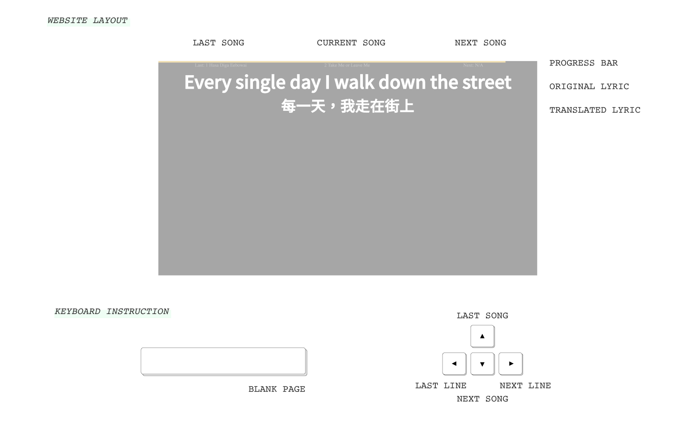

# lyricDisplay 

[DEMO](https://lynda0214.github.io/lyricDisplay/)

_This project is for the lyrics display in performance of the [Musical Club in National Taiwan University](https://www.facebook.com/ntumusical/)_

 

For the audience, they can only see these two: 

* **Original Lyric**
* **Translated Lyric**

For the lyric commander, there are two subtle UI helping you recognize where you are: 

* **Progress Bar** shows current progress (curren line / total lines) %
* **Current Song** shows current song title

There are 5 instinct commands for you: 

* **[SPACE] Blank Page** toggle off all visible UI except for progress bar. Useful when displaying lyrics is awkward. 
* **[LEFT] Last Line** go back to the last line of lyrics of current song. Useful when you are going to fast. 
* **[RIGHT] Next Line** go to the next line of lyrics of current song. Useful  all the way from a to z. 
* **[UP] Last Song** go back to last song. Useful when you are not on the same page of the show. 
* **[DOWN] Next Song** go to the next song. Useful when you finish the lines of current song. 

Uplaod file should follows: 

1. **File Name** \# song name.txt (ex. 1 Hasa Diga Eebowai.txt) 
2. **File Content** Original lyrics/Translated lyrics (ex. Hasa Diga Eebowai?/哈薩迪嘎伊伯蛙伊) for every single line
3. **Extra** Original Song Name from <Musical Name>/Translated Song Name from <Translated Muscial Name> (ex. Hasa Diga Eebowai from <The Book of Mormon>/哈薩迪嘎伊伯蛙伊) for the first line

For more infos, please see the following samples: 

[Sample 1](https://github.com/lynda0214/lyricDisplay/blob/master/lyrics/1%20Hasa%20Diga%20Eebowai.txt)  
[Sample 2](https://github.com/lynda0214/lyricDisplay/blob/master/lyrics/2%20Take%20Me%20or%20Leave%20Me.txt)